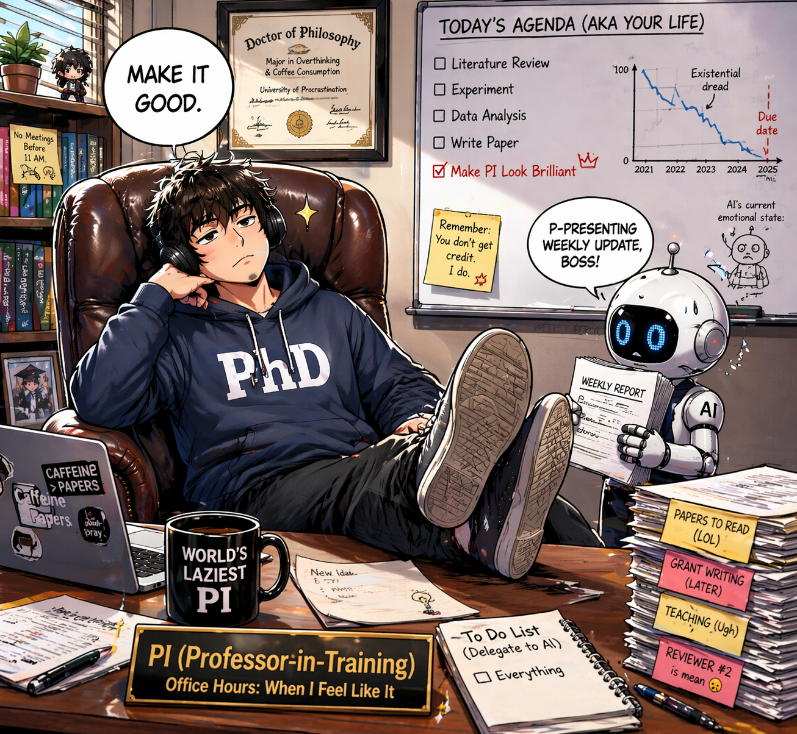

# sub-PHD 🎓🤖

[English](README.md) | 中文

> 给博士生带的 AI 博士生---“这是我的学生，可以当驴用。”

sub-PHD 是一个面向“人机协同+autoresearch”的本地多agent轻量框架。你通过定期同agent“开组会”来表达个人科研的思考、需求和调整，agent 像博士生一样不断按照你的**思路**去尝试和做实验。



## 🚀 如何安装

在个人的角度来看，新时代agent可以帮助我们学习新的工具、方法和框架，所以我**最推荐**的安装方式，就是**直接把下面这句话交给 Codex**：

```text
阅读 https://github.com/OneFav/subPHD/blob/main/index.md 并安装项目到本地
```

本项目专门为agent做了适配 `index.md` 是给 Codex 的安装契约。它会告诉 Codex：

- 部署仓库自带的两个 sub-PHD skill：1. `subphd-run-disclosure` 用于总结每一个长时间大轮次的执行情况。 2. `subphd-program-refinement` 用于协助修改 `person_program.md` ，方便进行下一轮任务。
- 向你询问必要的配置需求。
- 运行所需的本地验证，跑通一个最小轮次。

或者，你可以手动安装它：

1. clone 这个仓库
2. 让 Codex 读取 `index.md` 并跑通测试
3. 编辑 `person_program.md`
4. 用 `start.bat` 或 Python 入口启动

备注：由于Claude code额度消耗过快，Codex订阅给予额度较为丰富。所以本项目目前仅支持codex exec。当然，也可以使用api登录codex cli，推荐使用模型deepseek v4。

## 🧠 sub-PHD 是为了解决什么问题

这两年市面上的 AI 科研工具，大致分成两派。

第一派，把 AI 当成人的**延伸**。 Copilot 帮你写代码、Cursor 帮你改 bug、各种 research agent 帮你读 paper。这些工具都很好用，但它们有一个共同的前提，**你还是那个干活的人**，AI 只是你的延伸。问题是博士生最累的地方不只是“干活”。最累的是你既要干活、又要规划活、又要监督自己有没有在好好干活、还要在深夜自我怀疑这些活到底有没有意义。你一个人扮演了**课题组里老板、博后、博士生、自己老板的心理医生四个角色**。给这样的人加多少好用的“工具”，解放不了他。

第二派，把 AI 当成人的**替代**。 就是你这两年可能刷到过的各种“AI 科学家自动写完论文”、“端到端全自动科研 agent”。我自己也非常关注这类项目，但说实话，目前为止，它们还解决不了我作为博士生真正面临的现实问题。它们能跑 benchmark、能复现已有的 pipeline、能在预设好的领域上推进一些问题。但一个博士生的研究，**从来不是一条由别人预设好的轨道：你要解决的是你自己的具体问题，你要推进的是你自己领域里那个具体的想法，你要照顾的是你老板、你合作者、你方向上一堆只有你知道的约束**。这些东西，全自动 agent 目前很难真正理解，也没办法真正替你做好。 或许它可以模仿解决“做科研”这个问题，也做的很好，但没法深入到你这个博士生所处的具体语境里，很好的解决你的问题。结果就是，demo 很惊艳，落到你自己的博士论文上，没用。

所以 sub-PHD 选了第三条路：不做人的延伸，不做人的替代，做**人的学生**。它在设计上做了一件简单但关键的事，颠倒人和 agent 的位置。你不再是那个被 push 的博士生。你是导师。 agent 才是那个博士生。它听话、抗压、不会摆烂、不会因为老板一句话破防、不会在深夜给你发“老师我觉得我不适合科研”的微信。而你，站到了那个只有人才能站的位置上，决定方向的人、判断结果的人、为研究负责的人。 👨‍🎓🤖

## ✍️ 如何使用

1. 使用 `subphd-program-refinement` 与大模型交互，先确认你现在到底要做什么，并据此生成一份可信的 `person_program.md`。
2. 双击 `start.bat`，或者在命令行运行 `python scripts/research_autoloop.py --hours 4 --max-runs 30 --ignore-state`。
   其中 `4` 是最大时长、`30` 是最大运行次数，可以按你的实验规模自由调整。
3. 使用 `subphd-run-disclosure` 交互式查看当前运行情况，理解这一轮做了什么、得出了什么、离 `person_program.md` 还有多远。
4. 根据运行结果决定下一步：继续用 `resume.bat` 接着跑，或者回到第 1 步修改 `person_program.md` 。

## 🧰 内置技能

这个 starter 自带两个 sub-PHD skill，文档默认你会用它们来理解项目工作和收紧 mission。

### `subphd-run-disclosure`

当你想让 Codex 解释下面这些问题时，用它：

- 当前 run 在做什么
- 哪些结论真正有证据支持
- 有哪些证据存在
- 当前进度相对 `person_program.md` 到了哪一步

### `subphd-program-refinement`

当你想让 Codex 帮你改进 `person_program.md` 时，用它：

- 收紧一个还比较模糊的下一步研究方向
- 提出更好的 `person_program.md` 改写版本
- 让 mission 更正确，但不要过早写死

## 🔁 运行模型

- `start.bat` = 开启一个新的大轮次
- `resume.bat` = 继续当前状态
- continuity 通过 role-local window 控制，而不是无限累积长上下文
- authoritative handoff 的优先级高于 generic recent reports

## 📦 包含内容

- `index.md`：这个 starter 的初始化入口约定。Agent 首先读取它，再按其中流程安装仓库自带 skill、询问最少配置问题、填写框架文件并执行 smoke check。
- `skills/subphd-run-disclosure/`：用于“解释当前这一个大轮次到底做了什么”的 skill。它要求优先读取 `.subphd/` 里的报告、同步结果和 `run-state.json`，再给出面向人的证据式运行简报。
- `skills/subphd-program-refinement/`：用于把模糊研究方向逐步澄清成 `person_program.md` 候选改写稿的 skill。它强调一问一答、先产出候选版本，再等用户确认后落盘。
- `person_program.md`：人类维护的任务锚点文件。源码里把它当作 human-owned control document，定义当前 mission、优先级、reader/runner 职责以及本轮成功条件。
- `agent_program.md`：框架维护的执行策略文件。Reader 会在循环中直接更新它，把当前策略和下一步 handoff 收紧成 runner 可执行的任务边界。
- `research_agent.toml`：运行时总配置。这里定义默认模型、时长和轮次、SSH 远端执行参数，以及 `person_program.md`、`.subphd/state/*`、日志和同步结果等工件路径。
- `start.bat` / `resume.bat`：Windows 启动入口。两者都会启动 `research_dashboard.py` 和 `research_autoloop.py`；`start.bat` 先调用 `reset_runtime_state(...)` 并以 `--ignore-state` 新开一轮，`resume.bat` 则保留已有状态继续跑。
- `.subphd/`：框架的 canonical runtime root。源码会在这里建立 `state/`、`logs/`、`reports/`、`prompts/`、`commands/`、`synced-results/`、`autoloop/` 等目录，保存循环状态、观测数据、报告、提示词和同步回来的结果。
- `roles/`：Reader / Runner 的角色面定义。`research_agent_cli.py` 会读取这里的 `AGENTS.md` 和角色私有 `skills/`，把约束、职责和可激活能力拼进对应角色 prompt。
- `scripts/`：框架主实现目录。核心包括 `research_agent_cli.py`（单次角色启动与 prompt 组装）、`research_autoloop.py`（reader/runner/watch 自动循环）、`research_dashboard.py`（本地监控面板）和 `research_supervisor.py`（SSH 远端启动、轮询、结果同步）。

## 🔭 后续规划

1. 给出一个**不依赖 SSH** 的版本，面向主要在本地机器上直接跑实验的用户，降低初始配置门槛，让 sub-PHD 在单机科研场景下也能更顺手地使用。
2. 在 reader 和 runner 之外，增加一个新的 agent：**reviewer**。它一方面协助 reader 让任务拆解和推进过程更贴合 `person_program.md`；另一方面，在非算法实验类科研场景中，例如数据调查、文献梳理、数学计算、理论推导等，由 reviewer 明确定义评价方式与成功标准，让 sub-PHD 能适配更多科研任务类型。
3. 需要社区一起帮助推进：针对不同领域任务，逐步沉淀适配不同 roles 的 `AGENTS.md` 与 `skills/` 库，让框架不只适用于某一类研究，而是能在更多学科场景中复用。
4. 神秘更新，敬请期待。

   欢迎大家加入sub-PHD交流群~

   
